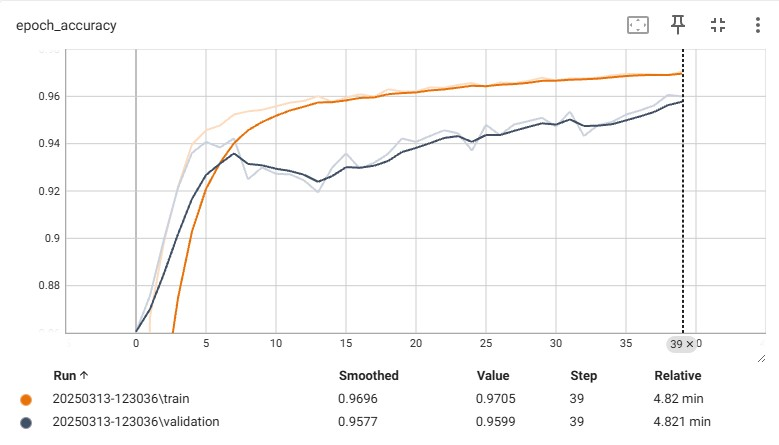
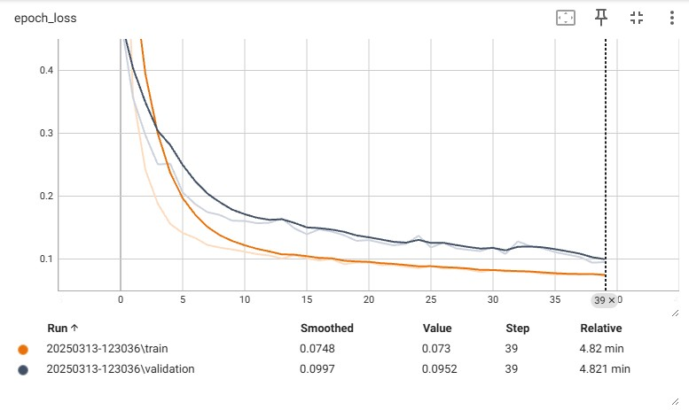

# Spot Nuclei. Speed Cures.

## Overview
The 2018 Data Science Bowl challenges participants to develop an algorithm to automate nucleus detection, which can accelerate research for various diseases such as cancer, heart disease, Alzheimer’s, and diabetes. Automating nucleus detection can lead to faster drug development and improved understanding of cellular responses to treatments.

## Why Nuclei Detection?
Identifying cell nuclei is crucial for biological research because:
- Most human cells contain a nucleus with DNA, which controls cellular function.
- Detecting nuclei helps researchers analyze cell reactions to treatments.
- Accelerating nucleus detection can reduce the time needed to bring new drugs to market.

---

## Dataset
- **Source:** 2018 Data Science Bowl
- **Structure:**
  - **Images:** RGB images of cells
  - **Labels:** Binary mask images representing nucleus locations
- **Preprocessing:**
  - Resize images and masks to `(128, 128)`
  - Normalize pixel values to `[0, 1]`
  - Convert mask values from `[0, 255]` to `[0, 1]`
- **Format:** Numpy arrays converted to TensorFlow tensors

---

## Model Architecture
The project uses a **UNet-based model** designed for image segmentation:
- **Encoder:** Contracting path with convolutional and pooling layers
- **Bottleneck:** Bridge layer with convolutional filters
- **Decoder:** Expanding path with transposed convolutions and skip connections

### Summary:
- Input size: `(128, 128, 3)`
- Output size: `(128, 128, 1)`
- Loss function: Binary cross-entropy
- Optimizer: Adam
- Metric: Accuracy

---

## Results

